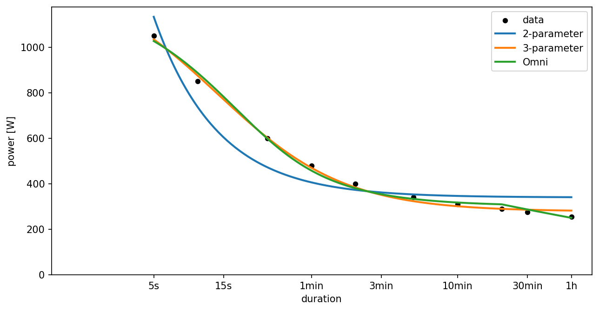
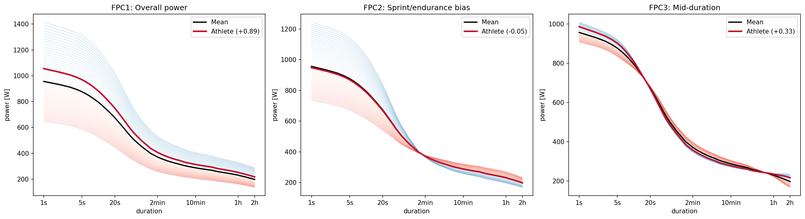

# Silhouette

The intensity-duration modelling toolkit for endurance sports. Scikit-learn compatible.

**[Try the interactive playground 🚀](https://silhouette.sweatstack.no)**

## Models

### Power (cycling)

| Model | Parameters |
|---|---|
| `TwoParamCriticalPowerRegressor` | CP, W' |
| `ThreeParamCriticalPowerRegressor` | CP, W', P_max |
| `OmniDomainPowerRegressor` | CP, W', P_max, a, tcp_max |
| `FPCAPowerRegressor` | FPC1, FPC2, FPC3 |

### Speed (running)

| Model | Parameters |
|---|---|
| `TwoParamCriticalSpeedRegressor` | CS, D' |
| `ThreeParamCriticalSpeedRegressor` | CS, D', S_max |
| `OmniDomainSpeedRegressor` *experimental* | CS, D', S_max, a, tcp_max |

## Installation

```bash
uv add silhouette
```

Or with pip:

```bash
pip install silhouette
```

## Quick start

### Power models (cycling)

```python
import numpy as np
from silhouette import OmniDomainPowerRegressor

durations = np.array([5, 10, 30, 60, 120, 300, 600, 1200, 1800, 3600])
power = np.array([1050, 850, 600, 480, 400, 340, 310, 290, 275, 255])

reg = OmniDomainPowerRegressor()
reg.fit(durations.reshape(-1, 1), power)

reg.cp_       # critical power (W)
reg.p_max_    # peak power (W)
reg.w_prime_  # anaerobic work capacity (J)

reg.predict(np.array([[300]]))  # predicted power at 5 minutes
```

All parametric models share the same interface. Swap `OmniDomainPowerRegressor` for `TwoParamCriticalPowerRegressor` or `ThreeParamCriticalPowerRegressor` and the code works the same way.

### Speed models (running)

```python
from silhouette import TwoParamCriticalSpeedRegressor

durations = np.array([120, 180, 300, 600, 900])
speed = np.array([5.8, 5.4, 5.0, 4.6, 4.4])

reg = TwoParamCriticalSpeedRegressor()
reg.fit(durations.reshape(-1, 1), speed)

reg.cs_       # critical speed (m/s)
reg.d_prime_  # distance capacity above CS (m)
```

Speed models use the same formulas as their power counterparts, with domain-appropriate parameter names, bounds, and defaults.

### FPCA model

```python
from silhouette import FPCAPowerRegressor

reg = FPCAPowerRegressor.from_model()
reg.fit(durations.reshape(-1, 1), power)

reg.fpc1_     # overall power level
reg.fpc2_     # sprint vs endurance bias
reg.fpc3_     # mid-duration specialization

reg.predict(np.array([[300]]))
reg.percentiles()  # {"fpc1": 72.3, "fpc2": 34.1, "fpc3": 55.8}
reg.z_scores()     # {"fpc1": 0.87, "fpc2": -0.41, "fpc3": 0.14}
```

## Known parameters

When parameters are already known, use `curve` directly without fitting:

```python
from silhouette import TwoParamCriticalPowerRegressor, TwoParamCriticalSpeedRegressor

t = np.arange(1, 3601)
power = TwoParamCriticalPowerRegressor.curve(t, cp=250, w_prime=20_000)
speed = TwoParamCriticalSpeedRegressor.curve(t, cs=4, d_prime=200)
```

## Duration range

Restrict which data points are used for fitting:

```python
reg = TwoParamCriticalPowerRegressor(duration_range=(120, 900))
reg.fit(X, power)  # only uses data between 2 and 15 minutes

reg.predict(X)           # predict still works at any duration
reg.duration_mask_       # boolean mask of which points were used
```

Models warn when data falls outside their recommended range. Set `duration_range` to suppress the warning and explicitly control the fitting window.

## Custom bounds

```python
reg = OmniDomainPowerRegressor(
    bounds={"cp": (200, 400), "p_max": (800, 1500)},
    initial_params={"cp": 280},
)
```

## Fitting methods

The two-parameter models support an alternative fitting method that minimizes error in work/distance space instead of power/speed space:

```python
reg = TwoParamCriticalPowerRegressor(fitting="work_duration")
reg.fit(X, power)
```

This linearizes the model to W = W' + CP·t and fits via OLS, giving more weight to longer durations. The default (`fitting="nonlinear"`) minimizes error in power space.

## Time to exhaustion

The inverse of the power-duration curve: given a power, how long can it be sustained?

```python
# On a fitted model
tte = reg.predict_inverse(np.array([250, 300, 350]))

# With known parameters
tte = TwoParamCriticalPowerRegressor.curve_inverse(350, cp=250, w_prime=20_000)
```

## Plotting

Install with plotting support:

```bash
uv add silhouette[plotting]
```

Plot data with fitted models (sklearn Display pattern):

```python
from silhouette.plotting import PowerDurationDisplay

# Single model
display = PowerDurationDisplay.from_estimator(reg, durations.reshape(-1, 1), power)

# Compare models
display = PowerDurationDisplay.from_estimators(
    [reg_2p, reg_omni], durations.reshape(-1, 1), power,
)
```



FPCA mode of variance:

```python
from silhouette.plotting import ModeOfVarianceDisplay

display = ModeOfVarianceDisplay.from_estimator(fpca_reg)
```



## References

- Monod, H., & Scherrer, J. (1965). The work capacity of a synergic muscular group. *Ergonomics, 8*(3), 329-338.
- Morton, R. H. (1996). A 3-parameter critical power model. *Ergonomics, 39*(4), 611-619.
- Puchowicz, M. J., Baker, J., & Clarke, D. C. (2020). Development and field validation of an omni-domain power-duration model. *Journal of Sports Sciences, 38*(7), 801-813.
- Puchowicz, M. J., & Skiba, P. F. (2025). Functional Data Analysis of the Power-Duration Relationship in Cyclists. *International Journal of Sports Physiology and Performance, 1*(aop), 1-10.
